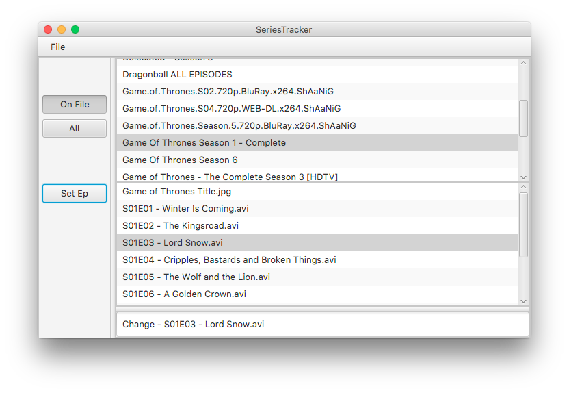

# MediaManager

GUI application that takes from a given file path of series directories that have been saved onto the users computer where the user can set current episode, this information is stored where there are two lists, one of anything that is currently on file and also one of anything that is on file and previously deleted.

Run from the src/GUI/MainApp class

# Things To Note
This application isn't smart enough to automatically group together a series if there are separate series directories within a folder, so its best to have all the episodes grouped under the one directory.

# Acknowledgments

For ordering naturally - https://github.com/paour/natorder  
